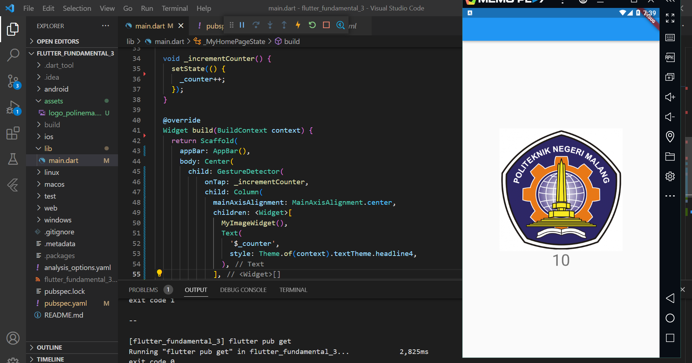
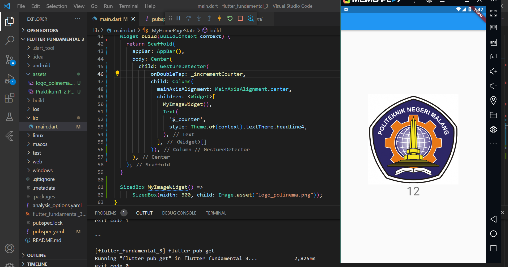
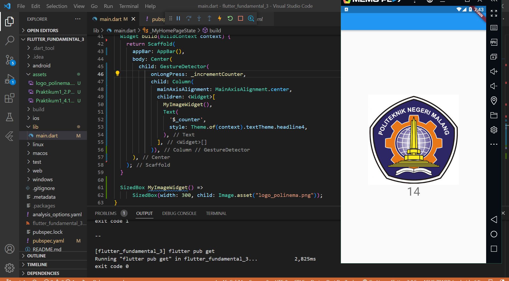
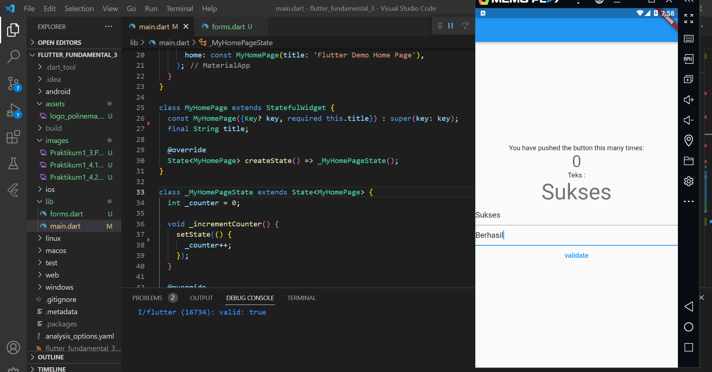
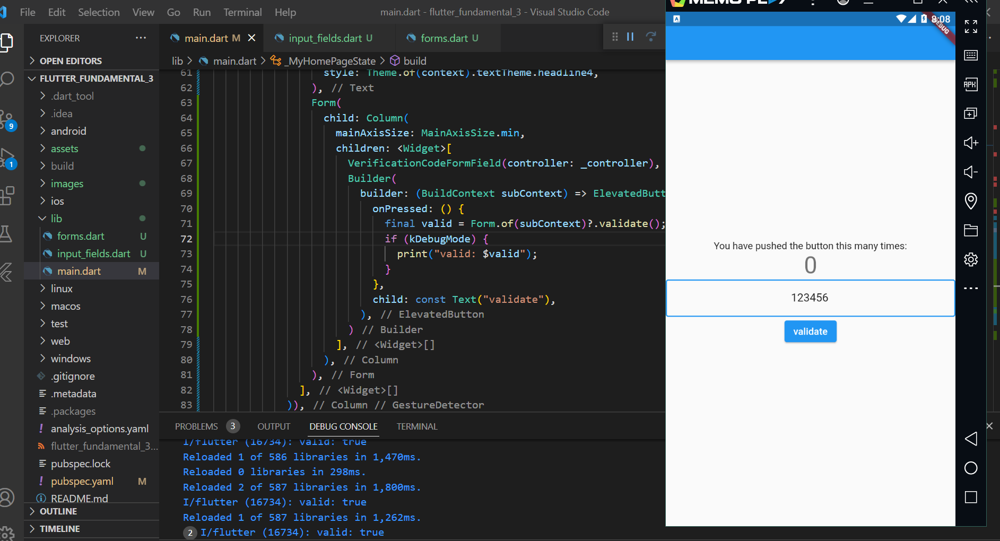

# flutter_fundamental_3

# Praktikum 1: Menerapkan Gesture Detector

## Langkah 3

Penjelasan: Pada saat melakukan klik/tap pada gambar, maka angka di bawah akan terus bertambah karena fungsi ontap pada gestur detector menjalankan fungsi _incrementCounter dimana angka akan bertambah +1

## Langkah 4

OnDoubleTap yaitu pada saat melakukan tap/klik 2 kali pada gambar akan menjalankan fungsi _incrementCounter

OnLongPress yaitu pada saat melakukan tap/klik dengan cukup lama pada gambar akan menjalankan fungsi _incrementCounter

# Praktikum 2: Menerapkan Input Widget dan Forms

# Praktikum 3: Menerapkan Custom Input dan FormField Widget

Penjelasan: Input field diatas hanya bisa berisikan angka dan tidak bisa selain angka. Karena Input field dibatasi hanya untuk angka 0-9